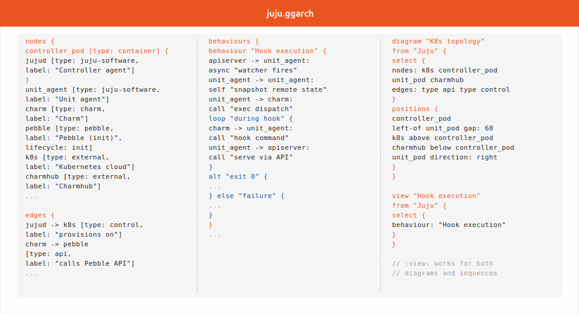

# ggarch

**Architecture diagrams as code -- branding, expressive power, and maintainability
together. Inspired by the Grammar of Graphics (ggplot2), Mermaid's sequence
diagrams, and Structurizr's model-driven approach.**

[](LICENSE)
[](SPEC.md)

Existing architecture diagram tools make you choose between branding, expressive
power, and maintainability. You can have one or two, but rarely all three.
ggarch aims to support all three.

See [COMPARISON.md](COMPARISON.md) for a detailed comparison with Mermaid,
D2, Graphviz, PlantUML, Structurizr, and Ilograph.

## What you get

In its first phase, ggarch is developed to serve [Juju](https://juju.is)
architecture documentation. The branding defaults and diagram vocabulary
reflect that. The design is general; other projects can override the preset
and extend the type system without touching ggarch itself.

### Branding

- Ubuntu font
- Juju orange and Canonical palette, light and dark themes
- Semantic visual grammar: colour encodes ownership, dash pattern encodes
  edge semantics (solid = sync, dashed = async/watch, dotted = IPC)
- `style` block for per-project colour and shape overrides
- Preset API on the roadmap: `ggarch.register_preset("myco", ...)` without
  patching the package

### Expressive power

- Typed nodes: `juju-software`, `charm`, `workload`, `container`, `database`,
  `record`, `class`, `person`, `external` -- plus any custom type
- Lifecycle: `persistent` (solid border), `init` (dashed), `ephemeral`
  (dotted)
- Cardinality: `one-per-unit`, `one-per-model`, etc. -- declare a type once,
  render as one archetype or N labelled instances
- Full-subtree instances: `instances:` stamps a type as N labelled
  copies, children included; model edges expand to the copies by an
  explicit pairing vocabulary (zip / fan / mesh)
- Runtime/persistence links: `records:` ties a running process to the
  database record that backs it — validated target, chip render
- Typed edges: `api`, `stream`, `event`, `control`, `ipc`, `data` -- each
  with a defined meaning and a consistent visual encoding, plus custom
  edge types styled in the model's `style` block (light and dark)
- Explicit placement: `left-of`, `above`, `fan`, `gap:`, `align-middle`
  -- every node's position is declared; Cassowary solves the constraints.
  Spatial intent is exact, not approximated by a layout engine. (Auto-layout
  as a default, with declarative overrides, is a roadmap goal.)
- Multiple view types from one model: topology, sequence, ER/schema, class,
  state machine
- Cross-cutting annotations: `box` regions that span the containment
  hierarchy without distorting layout
- Selective zoom: `collapse` and `expand` per node in each view -- mix
  levels of detail in one diagram
- Abstraction relationships: `abstracts:` declares that a concrete node
  realises an abstract one; edges stay valid across zoom levels
- Scope chips: `scope: "cloud/model"` renders a coloured provenance tag on
  each node

### Maintainability

- One model, many views: declare every node and edge once; all views draw
  from it. Rename a node once and it updates everywhere.
- Plain text: diffs cleanly, reviews in a PR, AI coding assistants can write
  and revise it fluently
- Validator: catches unknown ids, duplicate ids, constraint conflicts, and
  behaviour steps referencing abstract ids with no concrete realisation
- **Sphinx extension**: drop `{ggarch}` directives into any `.md` or `.rst`
  file; diagrams rebuild on source changes, with light and dark themes,
  slideshow carousels, and an expand modal
- SVG output: sanitised, no network calls at build time, no Node.js, runs
  in CI without special tooling

## Sneak peek

<div align="center">
  
</div>

*From `juju.ggarch` to a Markdown file with `{ggarch}` directives to a live
Sphinx page -- with the diagram, expand button, and caption all rendered.
Source: [`docs/juju.ggarch`](https://github.com/tmihoc/juju/blob/4.0-docs-rewrite-juju-architecture-juju-9632/docs/juju.ggarch).
Generated by [`scripts/render-assets.py`](scripts/render-assets.py).*

## Get started

ggarch is installed from source:

```bash
git clone https://github.com/tmihoc/ggarch
cd ggarch
pip install -e .
```

For Sphinx integration add the optional dependency:

```bash
pip install -e ".[sphinx]"
```

**Write a diagram.** Create `my-system.ggarch`:

```
model "My system" {
  nodes {
    api     [type: juju-software, label: "API server"]
    db      [type: database,      label: "Database"]
    client  [type: person,        label: "User"]
  }
  edges {
    client -> api [type: api,  label: "HTTP"]
    api    -> db  [type: data, label: "SQL"]
  }
  style { extends: juju }
}

diagram "Overview" from "My system" {
  select { nodes: client api db }
  positions {
    client left-of api gap: 60
    client align-middle api
    api    left-of db  gap: 60
    api    align-middle db
  }
}
```

**Check and render:**

```bash
ggarch check my-system.ggarch
ggarch render my-system.ggarch "Overview" --out overview.svg
```

**Use in Sphinx** (`conf.py`):

```python
extensions = ["ggarch.sphinxcontrib_ggarch"]
```

Then in any `.md` or `.rst` file:

```
{ggarch}
:file: my-system.ggarch
:view: Overview
:caption: The system at a glance.
```

For the full grammar, all node types, edge types, annotation kinds, sequence
syntax, and deployment environment resolution, see [SPEC.md](SPEC.md).

For step-by-step instructions on writing and editing diagrams -- including
how to work with an AI coding assistant -- see [SKILL.md](SKILL.md).

## Versioning

The minor version tracks the grammar. A MINOR bump may change the `.ggarch`
syntax or rendered output in a way that requires updating existing diagram
files. PATCH means fixes and renderer tweaks with no source changes required.
`1.0` is reserved for once the grammar is stable enough to freeze.

## License

Copyright (C) 2026 Teodora Mihoc.

Licensed under [Apache-2.0](LICENSE). Generated SVG output is not a derived
work of the tool and carries no licence obligations.
